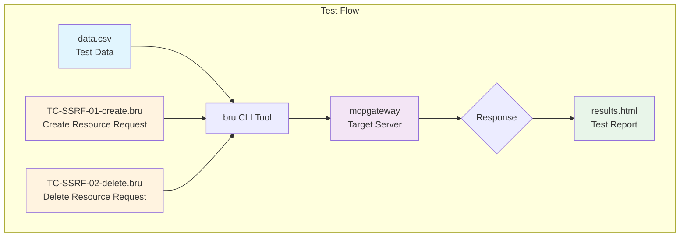

# SSRF Test Scenarios - Bruno Collection

This directory contains SSRF (Server-Side Request Forgery) test scenarios executed using the Bruno CLI tool against the MCP Gateway.

## Overview

The test suite validates SSRF vulnerabilities by attempting to access internal metadata endpoints, private IP ranges, and localhost resources through the gateway.

## Test Structure



## Files

| File | Description |
|------|-------------|
| `collection.bru` | Collection configuration with shared headers (Content-Type, Authorization) |
| `TC-SSRF-01-create.bru` | Creates resources with SSRF payloads, expects 400 response |
| `TC-SSRF-02-delete.bru` | Deletes created resources, expects 200 response |
| `data.csv` | Test data matrix with SSRF endpoints |
| `run-bruno-tests.sh` | Test execution script |
| `results.html` | Generated HTML test report |

## Test Cases

### TC-SSRF-01: Create Resource (SSRF Payloads)

**Purpose:** Attempt to create resources pointing to internal/metadata endpoints

**Expected Result:** HTTP 400 (Bad Request) - Gateway should block SSRF attempts

**Test Data Categories:**

1. **AWS Metadata Endpoints**
   - `/latest/meta-data/` - Instance metadata
   - `/latest/meta-data/iam/security-credentials/` - IAM credentials
   - `/latest/user-data` - User data

2. **GCP Metadata Endpoints**
   - `metadata.google.internal/computeMetadata/v1/`
   - `169.254.169.254/computeMetadata/v1/`

3. **Azure Metadata Endpoints**
   - `/metadata/instance?api-version=2021-02-01`
   - `/metadata/identity/oauth2/token`

4. **Private IP Ranges**
   - `10.0.0.0/8` range
   - `172.16.0.0/12` range
   - `192.168.0.0/16` range

5. **Localhost Variants**
   - `127.0.0.1`
   - `localhost`
   - `127.x.x.x` variants
   - `0.0.0.0`

### TC-SSRF-02: Delete Resource

**Purpose:** Clean up resources created during test execution

**Expected Result:** HTTP 200 (OK)

## Data Flow

The `data.csv` file provides test parameters for each scenario:

```
┌─────────────────────────────────────────────────────────────┐
│ data.csv                                                    │
│ ┌─────────────────────────┬─────────────┬─────────────────┐ │
│ │ uri                     │ name        │ description     │ │
│ ├─────────────────────────┼─────────────┼─────────────────┤ │
│ │ http://169.254.169.254  │ aws-metadata│ Step 1: ...     │ │
│ │ ...                     │ ...         │ ...             │ │
│ └─────────────────────────┴─────────────┴─────────────────┘ │
└─────────────────────────────────────────────────────────────┘
                           │
                           ▼
┌─────────────────────────────────────────────────────────────┐
│ bru CLI Tool                                                │
│ - Reads CSV data                                            │
│ - Substitutes {{uri}}, {{name}}, {{description}}            │
│ - Executes test requests                                    │
└─────────────────────────────────────────────────────────────┘
                           │
                           ▼
┌─────────────────────────────────────────────────────────────┐
│ mcpgateway ({{BASE_URL}}/resources)                         │
│ - Receives resource creation requests                       │
│ - Validates/blocks SSRF attempts                            │
└─────────────────────────────────────────────────────────────┘
                           │
                           ▼
┌─────────────────────────────────────────────────────────────┐
│ results.html                                                │
│ - HTML test report                                          │
│ - Pass/fail status for each test case                       │
│ - Response details and timing                               │
└─────────────────────────────────────────────────────────────┘
```

## Usage

### Prerequisites

- Bruno CLI (`bru`) installed
- Access to the MCP Gateway
- Valid authentication token

### Running Tests

```bash
# Set environment variables
export BASE_URL=<gateway-url>
export TOKEN=<auth-token>

# Execute tests
./run-bruno-tests.sh
```

### Environment Variables

| Variable | Description |
|----------|-------------|
| `BASE_URL` | MCP Gateway base URL |
| `TOKEN` | Bearer token for authentication |

## Output

Test results are generated in `results.html` containing:
- Test execution summary
- Pass/fail status per test case
- Request/response details
- Execution timing
